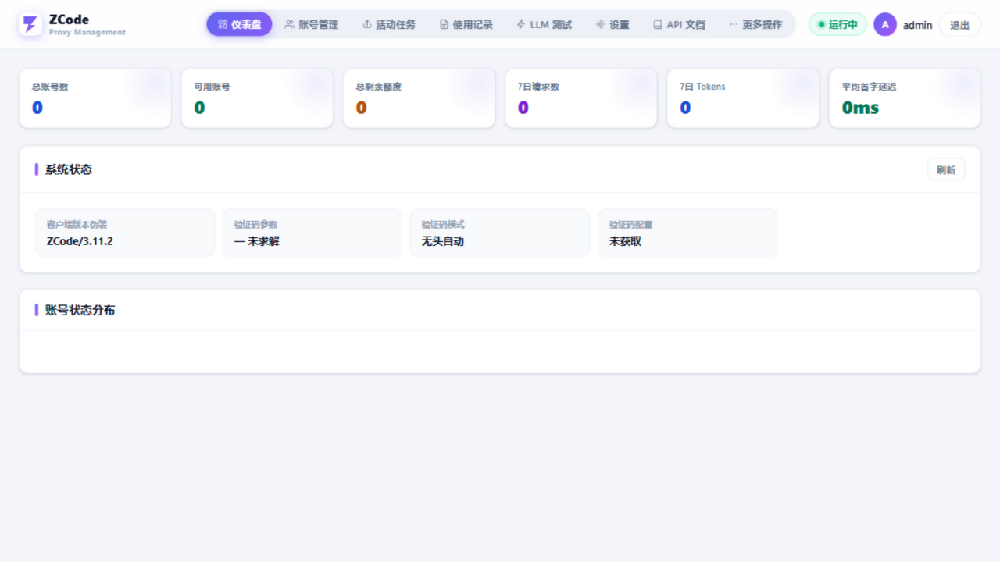
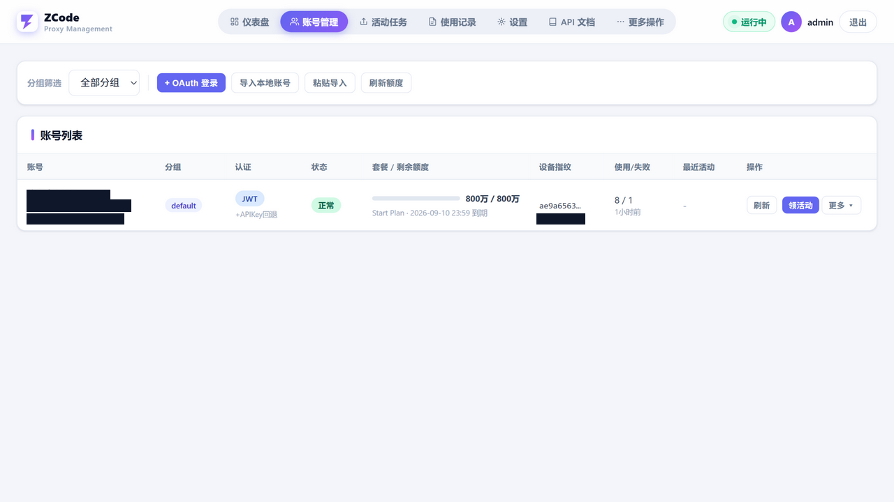
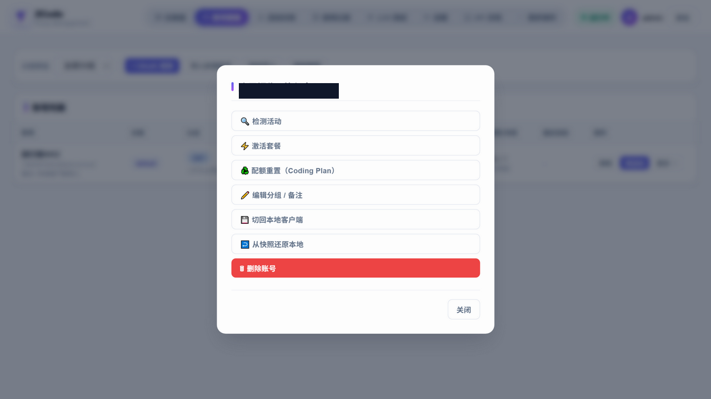
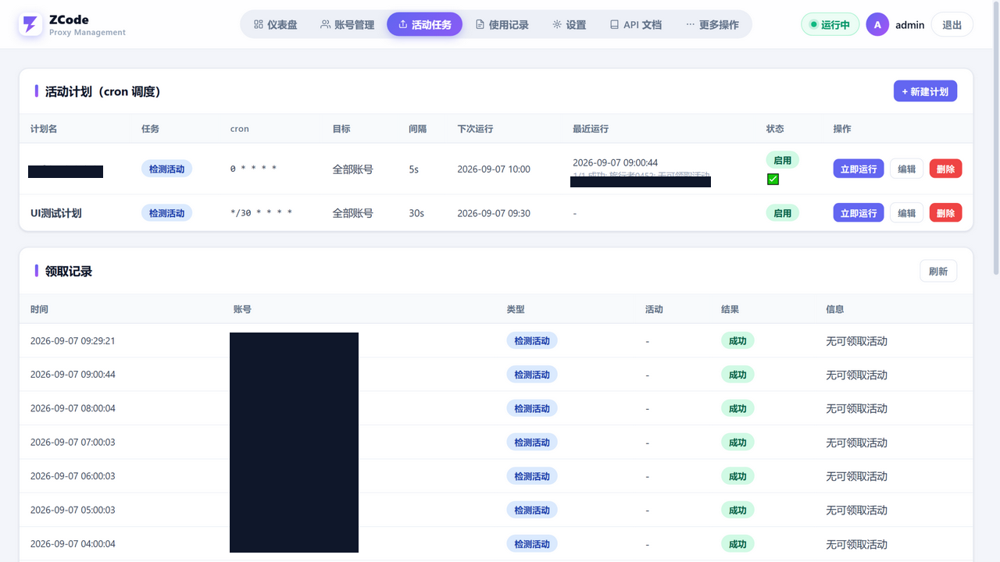
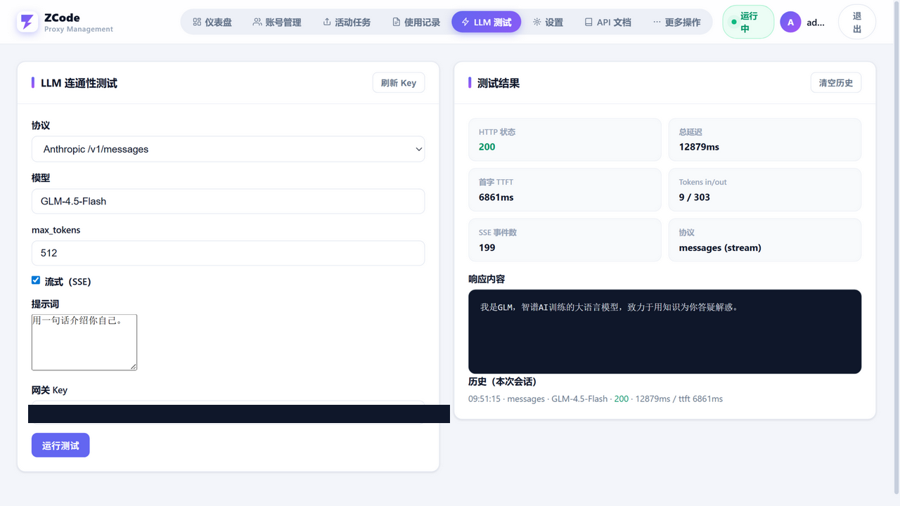

# ZCode Proxy

> **目前最完善的 ZCode（Z.AI / GLM Coding Plan）多账号管理 + 2API 工具。**
> 协议覆盖最全（OAuth / 免费额度通道 / 验证码自动求解 / 活动领取 / 配额重置 / 模型目录）、
> 三协议 2API 全支持（Anthropic Messages + OpenAI Chat + Responses，流式/工具/思考链完整）、
> 本地深度联动唯一实现（提取登录态 / 一键切回 / 快照还原 / 加密账号包跨机迁移）、
> 反检测工程化（utls 指纹按主机分流 + 真实浏览器验证码 + 设备指纹保持 + 分组出口代理）、
> 单二进制零依赖部署（embed UI + 纯 Go SQLite，拷贝即跑）。

Go 单二进制实现的 **ZCode（Z.AI / GLM Coding Plan）多账号管理 + OAuth 登录 + 活动检测领取 + Anthropic/OpenAI 兼容 2API 网关**。

## 为什么是"最完善"

| 维度 | 本项目 | 同类常见实现 |
|---|---|---|
| 协议面 | OAuth + 免费通道(验证码) + Key 通道 + 额度/活动/领取/激活/**配额重置**/模型目录 | 多为转发子集，无领取/重置 |
| 2API | Messages / Chat / Responses 三协议，流式+工具调用+思考链双向转换，usage/TTFT 落库 | 常仅 Messages 或仅 Chat |
| 账号池 | 分组 + 三策略 + 状态机自动恢复 + 429 退避重试 + 风控降级链 + 账号级互斥锁 | 简单轮询，无状态机/退避 |
| 验证码 | 真实 Chrome/Edge 无头自动求解 → 有头手动兜底，按代理分组缓存+宽限复用 | 手动填参或无 |
| 本地联动 | 提取登录态 / 一键切回 / 快照还原 / `zcb1:` 加密账号包 | 一般仅粘贴 token |
| 反检测 | utls 20+ 指纹按主机分流(h1/h2) + 设备指纹保持 + 分组出口代理 + IP 测试 | 裸请求或固定 UA |
| 可观测 | 仪表盘 / 额度构成弹窗 / LLM 测试页 / 运行与用量记录 / 报表 | 常无 UI 或仅列表 |
| 部署 | 单二进制 + embed UI + 纯 Go SQLite，无 CGO 无外部依赖 | 常需 Python/Node 运行时 |

## 参考项目（致谢）

本项目的协议与网关设计参考并整合自以下开源工作，特此致谢：

- **[liu5269/zcode2api](https://github.com/liu5269/zcode2api)** —— Z.AI 2API 网关的核心参考：上游端点、请求头、验证码绑定、额度归一化与状态机语义大量借鉴其实现；
- [pjpv/zcode-switch](https://github.com/pjpv/zcode-switch) —— 多账号切换 / 活动领取 / 本地凭证加解密（Rust）参考；
- [vibe-coding-labs/zcode-reverse-engineer](https://github.com/vibe-coding-labs/zcode-reverse-engineer) —— 协议逆向文档参考。

界面采用顶部 pill 导航 + 卡片 + 模态的管理台布局。

## 界面截图

| 仪表盘 | 账号管理 |
|---|---|
|  |  |

| 账号操作（模态） | 活动任务 |
|---|---|
|  |  |

| LLM 测试 |
|---|
|  |

## 功能总览

| 模块 | 说明 |
|---|---|
| 多账号管理 | 本地客户端一键导入 / OAuth 登录（免回调 CLI 轮询为主，手动粘贴备用）/ 粘贴 JWT·API Key；分组、启用策略（random / round_robin / best_quota）、状态机 |
| 2API 网关 | `/v1/messages`（Anthropic 原生）、`/v1/chat/completions`、`/v1/responses`、`/v1/models`、`/v1/messages/count_tokens`；SSE 流式 + 用量/TTFT 记录；上游端点按服务端 `agent/configs` 路由表自动重写（fail-open） |
| 闲时通道 | `/async/v1/messages`（Anthropic 原生）经上游 **off-peak 免费算力队列**：取票排队、SSE 注释帧保活、`X-Off-Peak-Ticket-ID` 调用、幂等关票、票回收自动重取；设置 `async_enabled` 开启 |
| 额度监控 | 后台周期刷新；账号页额度条**可点开**查看分套餐槽位与逐模型额度构成；驱动状态机 |
| 活动体系 | 检测（billing/preview）、领取（billing/claim + 阿里云无痕验证码）、激活（event/report）、**Coding Plan 配额重置**（reset/status·use·opportunity·history/read）；cron 调度 + 账号间防风控延迟 |
| 人机验证 | go-rod 驱动**本机真实 Chrome/Edge** 无头求解；失败自动升级有头手动；参数按出口代理分组缓存 |
| 指纹伪装 | utls 20+ 预置 ClientHello + 自定义 JA3；按主机选择传输策略 |
| 出口代理 | 分组绑定节点（SOCKS5/HTTP CONNECT）、默认节点、全局代理、系统代理探测、端口探测、出口 IP 测试 |
| 本地联动 | 解密 `~/.zcode/v2/credentials.json` 导入；一键切回（备份+原子写）；加密账号包 `zcb1:` 导出/导入 |
| LLM 测试页 | 三协议 × 流式/非流式在线测试（状态/延迟/TTFT/tokens/SSE 事件数/内容/历史） |
| 安全 | 首次启动随机生成口令（`ZCODE_WEB_PASS` 可覆盖，无默认口令）+ bcrypt + 登录限速退避（按 RemoteAddr）；`sk-` Key 常数时间比较；会话 SameSite=Strict；账号包导出需管理员密码二次确认；库内凭证 `vault1:` AES-256-GCM 静态加密（`ZCODE_PROXY_VAULT_SECRET` 可自定义种子，启动自动迁移存量明文）；凭证不落日志 |

## 功能详解

### 本地提取账号（一键导入本机 ZCode 登录态）

无需重新登录，直接从本机 ZCode 客户端提取已登录账号：

- 读取 `~/.zcode/v2/credentials.json`（`enc:v1:` AES-256-GCM 密文），用与官方一致的密钥派生公式
  （`SHA-256(zcode-credential-fallback:{平台}:{home}:{用户})`，可用 `ZCODE_CREDENTIAL_SECRET` 覆盖）解密；
- 提取 `zcodejwttoken`（Coding Plan JWT，免费通道凭证）、`oauth:*:access_token`（含 api_key 声明）、`oauth:*:user_info`（邮箱/昵称/user_id）；
- 读取 `~/.zcode/v2/config.json` 中 `builtin:*-coding-plan` 的明文 API Key（`{id}.{secret}` 完整格式）作为 Key 通道凭证；
- 读取 `telemetry-state.json` 的 `deviceMid` 作为设备指纹；**同时保存原始凭证快照**（供后续还原）；
- 以 `user_id` 为自然键 upsert 入库：重复导入不会覆盖设备指纹与快照；导入后自动刷新额度确认套餐状态。

### 一键切回本地客户端 & 账号还原

把网关里的任意账号"写回"本机 ZCode 客户端，使其成为客户端当前登录账号：

- **切回**：先备份 `credentials.json` + `config.json` 到 `data/backups/`（带时间戳）→ 将该账号的 JWT/access_token/user_info 重新 `enc:v1:` 加密、
  `config.json` 的 start-plan/coding-plan apiKey 与 enabled 更新 → **临时文件 + rename 原子写回** → 可选结束 `ZCode.exe` 进程使改动生效；
- **还原**：用导入时保存的原始快照一键撤销切回，恢复客户端原登录态（字节级一致）；
- 全程不破坏客户端其它配置项（仅替换登录态相关键）。

### 加密账号包迁移（跨机器）

- 导出：选中账号 → 输入管理员密码确认身份 → 设置密码 → 生成 `zcb1:` 前缀的加密串（`base64(salt16‖nonce12‖ct)`，PBKDF2-SHA256 60 万轮 + AES-256-GCM，旧 12 万轮包仍可导入），含 JWT/Key/设备指纹/快照；
- 导入：在另一台机器粘贴加密串 + 密码解密入库；密码错误直接拒绝，不落地明文。

### OAuth 登录（新账号）

- **免回调轮询登录（默认，推荐）**：与官方桌面端相同的 CLI 轮询流程 —— `POST /api/v1/oauth/cli/init` 取授权 URL（附加桌面中转参数）→ 浏览器任意设备打开并授权（中转页在服务端记录结果，不回连本机，无需注册 redirect_uri）→ 网关轮询 `/oauth/cli/poll/{flow_id}` 自动入库；
- 手动粘贴（备用）：复制授权后地址栏 `zcode.z.ai/login?code=…` 完整 URL 贴回网关兑换；
- 环回模式（`127.0.0.1:8687/oauth/callback`）保留为实验项（当前会报 `Redirect URI not registered`）；
- 兑换链：`code/poll → Coding Plan JWT + access_token` → 自动提取 API Key（z/login → customer → api_keys → copy）→ 补查 userinfo → 入库 + 刷新额度。

### 活动检测 / 领取 / 激活 / 配额重置

- **检测**：`billing/preview` 列出可领活动（plan_id/优先级/entitlements 赠送明细含 capabilities 与生效时间）；
- **领取**：`billing/claim {plan_id}` + 阿里云无痕验证码头；错误码语义化处理（1003 已领过视为幂等成功、1005 名额用完读 next_at）；
  账号级互斥锁保证 UI 手动与 cron 计划并发不双领；
- **激活**：上报 `event/report`（app_launch + app_daily_active，含 device_mid/user_id）触发服务端授予 Start Plan；
- **配额重置**：`coding-plan/reset/status` 查 five_hour/week 重置机会 → `reset/use {idempotency_key, reset_type}` 消耗机会恢复配额；
- **调度**：cron 计划（分钟级去重 + per-plan 互斥 + 账号间随机延迟防风控），任务类型 detect/claim/activate/reset，运行记录可查。

### 额度监控与构成弹窗

- 后台按 `quota_refresh_interval` 周期刷新（0=关闭）；成功后节流 30s 防惊群；
- 账号页额度条**可点击**：弹窗展示分套餐槽位（plan_id/档位/状态/到期/进度）与逐模型明细（总额/已用/剩余/占比/周期）；
- 额度驱动状态机：耗尽→exhausted、限流→cooling、鉴权失败→invalid（后台按退避自动重试，鉴权恢复即自动复活）、无订阅→inactive。

### 2API 网关与协议转换

- 三入口：Anthropic `/v1/messages`、OpenAI `/v1/chat/completions`、`/v1/responses`，外加 `/v1/models`、`/v1/messages/count_tokens`；
- 请求/响应双向转换（system/tool/image/thinking/tool_choice 全映射），SSE 流式逐帧转换并嗅探 usage/TTFT 落库；
- 上游错误不伪装成功：流内 `error` 事件与中途断流均按失败处理（OpenAI 发错误 chunk、Responses 发 `response.failed`）。

### 人机验证 / 指纹 / 出口代理

- 验证码：go-rod 驱动本机真实 Chrome/Edge 无头求解阿里云无痕验证（持久化 profile 保留风控 cookie），连败自动升级有头手动；参数按出口代理分组缓存 45s + 300s 宽限；
- 指纹：utls 20+ 预置 + 自定义 JA3；`zcode.z.ai` 走指纹+HTTP/1.1（ESA WAF），`api.z.ai` 走标准库+HTTP/2（ALPN 仅 h2）；
- 代理：分组绑定节点（SOCKS5/HTTP CONNECT）+ 默认节点 + 全局代理；系统代理探测、本机端口探测、出口 IP 测试。

### LLM 测试页与安全

- 测试页：三协议 × 流式/非流式，实时显示状态/总延迟/TTFT/tokens/SSE 事件数/响应内容/会话历史；
- 安全：管理口令 bcrypt + 登录 IP 指数退避限速；`sk-` Key 常数时间比较；会话 SameSite=Strict；凭证与 token 从不落日志；未知 `/api/*`、`/v1/*` 返回 404 防探测混淆。

---

# 技术细节

## 1. 总体架构

```
                        ┌──────────────────────────────────────────────┐
 客户端(Claude/Cursor) │  HTTP mux (auth.Middleware)                  │
   /v1/*  (sk- Key) ──▶│  ├─ handler: messages / chat / responses     │
 管理浏览器            │  ├─ /api/*  管理 REST (session)              │
   /web, /api/* ──────▶│  └─ /web    embed SPA                       │
                        │                                            │
                        │  relay(转发核心)                            │
                        │   ├─ AccountPool.Select (策略+状态机过滤)    │
                        │   ├─ 降级链: JWT+验证码 → JWT直连 → APIKey   │
                        │   ├─ CaptchaService (rod, 按代理分组缓存)    │
                        │   ├─ ClientForURL (utls|h2 按主机, 连接池缓存)│
                        │   └─ SSE 嗅探 → usage_records              │
                        │                                            │
                        │  后台: 额度刷新循环 / cron 调度器            │
                        │  存储: SQLite(WAL, 单写连接) embed 于二进制   │
                        └──────────────────────────────────────────────┘
                          │                        │
              zcode.z.ai (ESA WAF, h1+utls)   api.z.ai (h2, 标准库)
```

单二进制 = Go + `//go:embed web` + `modernc.org/sqlite`（纯 Go，无 CGO）。依赖：`utls`（TLS 指纹）、`go-rod`（验证码）、`x/net`（SOCKS5）、`x/crypto`（bcrypt/PBKDF2）、`google/uuid`。

## 2. `/v1/messages` 请求生命周期

1. **鉴权**：`x-api-key` 或 `Authorization: Bearer` → 与 DB `settings.api_key` 做 `subtle.ConstantTimeCompare`。
2. **规范化**：模型名大小写/前缀映射（`glm-5.3`→`GLM-5.3`、`bigmodel/x`→provider 路由）；GLM-5.3 思考归一化为上游现行格式（对齐 zai-org/ZCode 3.14.x）：思考开启 → `{thinking:{type:adaptive},output_config:{effort:low|high|max}}`（由 budget_tokens/reasoning_effort 映射），未请求思考 → `{thinking:{type:disabled}}`；string content 桥接为 `[{type:text}]`；body 上限 8MB。
3. **选号**：`AccountPool.Select(provider, group, skip)` 按策略（round_robin 游标 / random / best_quota）过滤 `enabled && 状态可选 && 有凭证`；冷却中账号到期自动可选。
4. **降级链**（每账号）：
   - 路径1 `JWT + X-Aliyun-Captcha-Verify-Param` → `zcode.z.ai/.../anthropic/v1/messages`（验证码被拒则失效缓存重解，最多 3 次；无验证码参数（mode=off 或求解失败）时跳过）；
   - 路径2 `JWT 直连`（上游放宽时零延迟）；
   - 路径3 `x-api-key` → `api.z.ai/api/anthropic/v1/messages`（无需验证码）。
5. **上游错误分类**：`401/403→invalid`；`429→请求内退避重试一次(尊重 Retry-After≤5s)，仍失败 cooling 30s`；`402/余额短语→exhausted`；`3012 unusual activity→风控，试其余路径，全败 cooling`；`3xx→cooling(WAF 挑战)`；`2xx 但非 json/sse→cooling`；其余原样回传。挑战页（3xx / 2xx 非 JSON/SSE）返回客户端时统一为 `502`，不伪装 200。
6. **成功**：`MarkUsed`（cooling/exhausted 复活为 active）+ 节流额度刷新（30s）+ 流式透传/转换 + SSE 嗅探写 `usage_records`（含 TTFT）。
7. **全败**：503 `no_available_account`，若因冷却则附「约 N 秒后自动恢复」与最近失败原因链。

## 3. 并发与锁模型

| 锁/原语 | 位置 | 语义 |
|---|---|---|
| `pool.rotation` (mutex) | 选号游标 | round_robin 按 `group|provider` 递增 |
| `claimLocks[id]` (per-account mutex, TryLock) | 领取/重置 | UI 手动与 cron 并发不双领/双重置 |
| `groupSem` (per-proxy-group cap-1 chan) | 验证码 | 按出口代理分组唯一求解，前台等待 45s 上限；后台刷新用非阻塞 TryAcquire，**无锁泄漏路径** |
| `execLocks[planId]` (per-plan mutex, TryLock) | cron | 长计划不排队堆积，cron 拿不到锁跳过本 tick；手动运行拿不到锁报「计划正在执行中」 |
| `clientCache` (sync.Map) | HTTP 客户端 | 键 `(proxy, 指纹, JA3, timeout, 是否zcode)`；设置变更 `CloseIdleClients()` |
| SQLite `MaxOpenConns(1)` + WAL | 存储 | 单写串行，busy_timeout 5s |

## 4. 数据库 Schema（SQLite, WAL）

| 表 | 关键列 | 用途 |
|---|---|---|
| `accounts` | `user_id`(自然键, UNIQUE), `auth_type`, `zcode_jwt`, `api_key`, `access_token`, `device_mid`, `creds_raw`, `status`, `enabled`, `account_group`, `quota_json`, `plan_tier/expire`, `total/used/remaining`, `cooling_until`, `use/fail_count` | 账号+凭证+额度快照；upsert 用 `COALESCE(NULLIF(excluded.x,''), x)` 保留 device_mid/creds_raw |
| `settings` | KV | 策略/刷新间隔/代理/指纹/验证码模式/模型清单/口令哈希/api_key |
| `claim_plans` | cron_expr, task_type(detect/claim/activate/reset), target_type, delay_seconds, last_run_* | 活动/重置计划 |
| `claim_records` | account_id, task_type, plan_id, success, code, next_at | 领取/检测/重置历史 |
| `usage_records` | account_id, model, in/out/total tokens, stream, status_code, duration_ms, ttft_ms | 用量与延迟 |
| `proxy_nodes` | type/host/port/auth, is_default, group_name, check_* | 分组出口代理 |
| `plan_run_records` | plan_id, status, success/fail_count, duration_ms | 计划运行历史 |

## 5. 上游协议细节

### 5.1 端点

| 用途 | 端点 | 认证 |
|---|---|---|
| 消息（免费通道） | `POST zcode.z.ai/api/v1/zcode-plan/anthropic/v1/messages` | Bearer JWT + 验证码头 |
| 消息（Key 通道） | `POST api.z.ai/api/anthropic/v1/messages` | `x-api-key` |
| 额度 | `GET zcode.z.ai/api/v1/zcode-plan/billing/balance?app_version=`（现行端点；`billing/current` 已废弃仅兜底） | Bearer JWT |
| Key 通道额度 | `GET api.z.ai/api/monitor/usage/quota/limit` + `/api/biz/subscription/list` | Authorization 直传 Key（无 Bearer 前缀，对齐官方客户端） |
| 活动预览 | `GET zcode.z.ai/api/v1/zcode-plan/billing/preview?app_version&platform` | Bearer JWT |
| 领取 | `POST zcode.z.ai/api/v1/zcode-plan/billing/claim` `{plan_id}` | Bearer JWT + 验证码头 |
| 激活 | `POST zcode.z.ai/api/v1/event/report`（app_launch + app_daily_active） | Bearer JWT |
| 配额重置 | `GET/POST zcode.z.ai/api/v1/coding-plan/reset/{status,use,opportunity,history/read}` | Bearer JWT + `X-Bigmodel-Authorization` + `Bigmodel-Target-Type` |
| OAuth | `chat.z.ai/api/oauth/authorize` → `zcode.z.ai/api/v1/oauth/token` → `api.z.ai/api/auth/z/login` → `biz/customer/getCustomerInfo` → `biz/v1/organization/{org}/projects/{proj}/api_keys` → `.../copy/{key}` | — |
| 验证码配置 | `GET zcode.z.ai/api/v1/client/configs?version&os` → `data.configs.captcha{enabled,prefix,region,sceneId}` | — |
| 模型目录 | 同上 → `data.builtinModels[] / providers[]` | — |

### 5.2 请求头（与官方客户端一致）

身份头：`User-Agent: ZCode/{ver}`、`X-ZCode-App-Version`、`X-Title: Z Code@electron`、`X-Platform: win32-x64`、`X-Release-Channel: stable`、`X-Client-Language`(Intl locale)、`X-Client-Timezone`(Intl tz)、`X-Os-Category`(win32→windows)、`X-Os-Version`(10.0.build)、`X-Device-Mid`(telemetry-state.json)、`x-request-id`(uuid)。
消息通道追加：`anthropic-version: 2023-06-01`、`X-ZCode-Agent: glm`、`HTTP-Referer: https://zcode.z.ai`、`X-Aliyun-Captcha-Verify-Param`(+Region)（注：官方客户端 3.14.x 已移除模型请求验证码，该头仅在 `client/configs` 报告 captcha.enabled 时发送）。

### 5.3 错误码语义

| code | 含义 | 网关动作 |
|---|---|---|
| 1001/1002 | 套餐不存在 / 活动已结束 | 提示 |
| 1003 | 已领取过 | 视为成功空跑（幂等） |
| 1004 | 不符合条件 | 提示 |
| 1005 | 今日名额用完 | 读 `data.plan.ends_at` → next_at |
| 3001 / 3007 | 参数错 / 验证码失败 | 重解验证码重试 |
| 3101 | coding plan is required | 重置门槛不满足 |
| 3301 | 重置机会授予 | 成功 |
| HTTP 3012 | unusual activity（风控） | 试其余路径，全败 cooling |
| HTTP 429 | 限流 | 退避重试→cooling 30s |

## 6. SSE / 协议转换

- **Anthropic→OpenAI chat**：`message_start→首 chunk(role)`、`content_block_delta.text_delta→delta.content`、`thinking_delta→delta.reasoning_content`、`tool_use→delta.tool_calls[index]`、`message_delta→finish_reason`、末尾 `usage chunk(include_usage)` + `[DONE]`。
- **Anthropic→Responses**：`response.created/output_item.added/content_part.added/output_text.delta/function_call_arguments.delta/output_text.done/output_item.done/response.completed`；错误/断流发 `response.failed`。
- **OpenAI→Anthropic 请求**：system/developer→`system` 串；tool→`tool_result`；assistant.tool_calls→`tool_use`；image_url(data:)→base64 image；tool_choice auto/required/name 映射。
- **Responses→Anthropic**：instructions→system；input[] 的 message/function_call/function_call_output 映射；reasoning.effort→reasoning_effort。
- **健壮性**：SSE 解析缓冲上限 16MB（超限按流失败处理，不静默清空）、跨 chunk 断帧兼容 LF/CRLF；命名 `event:error`、匿名 `data:` 错误帧（顶层 `error` 字段或 `type=error`）与 `err!=io.EOF` 均按失败处理（不伪装成功）。

## 7. 验证码子系统（阿里云无痕）

> 官方客户端自 3.14.3 起源码中已无任何验证码逻辑（模型请求免验证），本子系统仅在 `client/configs` 报告 `captcha.enabled` 时参与请求，否则自动跳过；保留用于领取等仍可能触发的场景。

- 配置：`client/configs` → `{enabled,prefix,region,sceneId}`，缓存 10min。
- 求解：rod 启动**本机真实 Chrome/Edge**（捆绑 Chromium 会被风控识别），先访问 `zcode.z.ai` 建立同源，注入 SDK HTML（配置值经 JSON 转义防注入），`startTracelessVerification` → `__onCaptcha` 回调捕获 param；持久化 user-data-dir 保留风控 cookie。
- 缓存：按**出口代理**分组，TTL 45s；过期后 300s 宽限期内返回旧值并后台刷新；失败缓存 60s 防风暴；无头连败 2 次升级有头手动。
- 风控：数据中心 IP 触发 F001；参数单次/短时有效，被拒即失效重解。

## 8. TLS 指纹与传输策略

- 官方栈：Electron 41 / Chromium 146（BoringSSL、TLS1.3、PQ 曲线 X25519MLKEM768=4588、ECH=65037、ALPS=17613）。
- 实测：zcode.z.ai 的 ESA WAF **不做严格 JA3 白名单**（stdlib/utls/浏览器均放行），风控基于行为/验证码/频率；api.z.ai **ALPN 仅 h2**。
- 策略：`zcode.z.ai` → utls 预设（默认 Chrome 族）+ **HTTP/1.1**；其余 → 标准库 + **HTTP/2**；客户端按 `(proxy,指纹,JA3,timeout,主机)` 缓存。
- 自定义 JA3：5 段（版本,套件,扩展,曲线,点格式）→ `utls.ClientHelloSpec`；设置页服务端预校验。

## 9. 本地凭证与切回

- `~/.zcode/v2/credentials.json`：`enc:v1:` + b64url(nonce12).b64url(tag16).b64url(ct)，AES-256-GCM；key = SHA-256(`zcode-credential-fallback:{win32}:{home}:{user}`) 或 `ZCODE_CREDENTIAL_SECRET`。与官方/参考实现逐字节兼容（含跨语言测试向量）。
- 切回：备份 `credentials.json`+`config.json` 到 `data/backups/` → 重新加密写回（临时文件+rename 原子）→ 可选结束 ZCode.exe；快照还原可撤销。
- 账号包：`zcb1:` + base64(salt16‖nonce12‖ct)，PBKDF2-SHA256 120k 轮 + AES-256-GCM。

## 10. 配置参考

`config/config.json`（首次运行生成）：`listen_addr`、`app_version`(空=注册表探测)、`models[]`、`upstream{zai,zai_fallback,bigmodel}`。
`settings`（界面/`PUT /api/settings`）：`selection_strategy`、`quota_refresh_interval`(0=关闭)、`upstream_proxy`、`fingerprint`、`custom_ja3`、`captcha_mode`(auto/manual/off)、`gateway_models`、`api_key`、`password_hash`(bcrypt)、`async_enabled`(闲时通道开关)、`async_poll_interval_ms`、`async_keepalive_ms`、`async_max_retries`、`async_max_wait_sec`。

## 11. 管理 API（节选，session 鉴权）

`/api/login|logout|auth/check|auth/password`；`/api/dashboard`；`/api/accounts`(GET/PUT/DELETE) + `/import/local|paste|bundle` + `/export` + `/{id}/refresh|claim|detect|activate|reset|reset-status|switch-back|restore-local`；`/api/groups`；`/api/plans`(CRUD+`/{id}/run`)+`/plan-runs`+`/claim-records`；`/api/usage-records`+`/stats`；`/api/settings`+`/settings/api-key[/generate]`；`/api/proxies`(CRUD+`/{id}/test`+`/test-url`+`/system`+`/probe-ports`)；`/api/captcha/status|invalidate|solve`；`/api/fingerprints`；`/api/models[/sync|/catalog]`；`/api/accounts/oauth/start|manual|status`。

## 12. 构建 / 部署 / 测试

```bash
go build -o zcode-proxy.exe .   # 纯 Go 无 CGO
./zcode-proxy.exe -config config -db data/zcode.db
go test .                        # enc:v1 往返 + 跨语言向量（向量缺失自动 skip）
go vet .
```

## 13. 已知限制

- utls v1.8.2 无法表达 PQ 曲线 4588 与新 ALPS id（17613），自定义 JA3 的 key_share 仅 X25519；
- OAuth 环回 redirect_uri 未被 Z.AI 注册（`Redirect URI not registered`），默认手动粘贴模式；
- 多出口代理下验证码参数按代理分组缓存，跨组不共享；
- `/v1/messages/count_tokens` 为保守估算（字符/4+开销；官方客户端 3.14.x 已不调用该端点，仅为兼容保留）。
- GLM-5.3 思考参数对上游按官方 3.14.x wire 格式发送（`thinking:{type:adaptive}` + `output_config.effort`）；上游若回退旧版可能需重新调整。
- 账号包导出使用 PBKDF2 60 万轮；旧 12 万轮加密包仅支持导入（自动回退），不再生成。
- 库内凭证已静态加密（`vault1:`），密钥默认绑定本机（平台/home/用户名）；跨机器迁移 `data/` 时请同设 `ZCODE_PROXY_VAULT_SECRET`。
- `/async/v1/messages` 闲时通道为一次性应答、无会话记忆（上游语义）；多轮对话请在请求内携带历史。

## 仓库与数据边界

`data/`（SQLite/备份/浏览器 profile）、`*.log`、`*.exe`、`config/config.json`、`refs/` 均在 `.gitignore`，**不会提交**；`data/` 含真实账号凭证，请勿外传。克隆后首次运行自动生成配置与空库。

## 免责条款

1. **学习交流目的**：本项目仅供个人学习、研究和技术交流使用，旨在帮助理解 OAuth 授权流程、API 网关设计、TLS 指纹与客户端凭证存储等通用技术原理；**不得用于任何商业盈利、对外售卖服务或任何形式的违法用途**。
2. **遵守服务条款**：使用本项目即表示你承诺遵守 Z.AI / ZCode 的服务条款、用户协议与相关法律法规；本项目不鼓励、不协助任何违反服务条款的行为（包括但不限于滥用免费额度、绕过付费、批量注册、转租账号）。
3. **风险自担**：因使用本项目导致的账号限流（429）、风控拦截（3012）、套餐冻结、账号封禁、额度损失等后果，均由使用者自行承担；作者不提供任何形式的补偿或恢复保证。
4. **凭证安全自负**：本项目会在本地存储账号凭证（JWT / API Key / 凭证快照）。使用者应自行保管好本机与 `data/` 目录、加密账号包与网关 `sk-` Key；因保管不当导致的凭证泄露、账号被盗用、财产损失，作者不承担责任。
5. **无担保**：本项目按"现状"提供，不作任何明示或暗示的担保（包括可用性、稳定性、准确性、不侵权）；上游接口可能随时变更、限流或下线，本项目不保证持续可用。
6. **合规使用网络与代理**：使用者应确保所用出口代理、网络环境合法合规；因代理或网络行为引发的法律责任由使用者承担。
7. **侵权处理**：若本项目内容侵犯了你的合法权益（含商标、版权），请联系作者，将在核实后第一时间删除相关内容。
8. **法律适用**：因使用本项目产生的任何争议，适用使用者所在地法律法规；继续使用即视为已阅读并同意本免责条款全部内容。

> 简而言之：**仅供学习交流，商用与违法用途禁止；账号与凭证风险自负；上游规则变化不保证兼容。**
